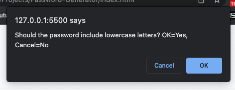
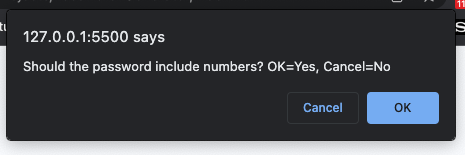

# Password-Generator
A secure password generator using JavaScript.

## Description
This web app is designed to generate a random password using specified criteria given by a user. The application receives input from the user using console prompts.
## Installation
Load index.html file to access landing page. CSS styling is external but linked within index.html page.
## Usage
The usage of this web app is fairly straight forward. The user will be presented with a red "Generate Password" button. The user is to click the button and will then be presented with prompts to give criteria.

After the button is pressed, the user will be prompted to enter the number of characters between 8 and 128 characters.

Once the user enters the number of characters, they will be asked if the password should include Lowercase letters. The user is to click "OK" for yes and "Cancel" for no.

Once the user confirms if the password should include lowercase letters, they will be asked if the password should include Uppercase letters. The user is to click "OK" for yes and "Cancel" for no.

Once the user confirms if the password should include uppercase letters, they will be asked if the password should include numbers. The user is to click "OK" for yes and "Cancel" for no.

Once the user confirms if the password should include numbers, they will be asked if the password should include special characters. The user is to click "OK" for yes and "Cancel" for no.

A password will then be displayed on the screen in the "Your Secure Password" textbox.

Page can alternatively be accessed [here](https://nadeemtalaat.github.io/Password-Generator/).

## Credits
- Nadeem Talaat
- Source code provided by UofT Coding Bootcamp.

## License
[MIT](https://choosealicense.com/licenses/mit/)
